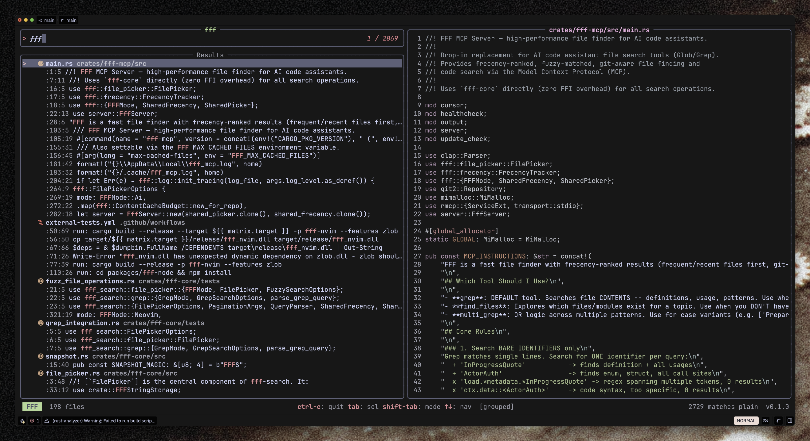

# FFF TUI
This is probably riddled with bugs. Terminal user interface for [fff](https://github.com/dmtrKovalenko/fff), so you can (fairly) easily use it in other applications. Basically [television](https://github.com/alexpasmantier/television) with a different backend and crappy UI implementation. 


# Modes

The TUI exposes several searchable scopes and match modes that you can toggle on the fly.

| Scope | Description | Key |
|-------|-------------|-----|
| **Unified** | Search files and file contents at the same time | `Ctrl+T` |
| **Files** | File-name fuzzy search only | `Ctrl+T` |
| **Grep** | Content (line) search only | `Ctrl+T` |

Within **Grep** or **Unified** scope, the query engine supports three matchers that you cycle with `Shift+Tab`:

| Matcher | Description |
|---------|-------------|
| **plain** | Literal substring search |
| **regex** | Regular-expression search |
| **fuzzy** | Fuzzy token search |

Additional toggles (shown in the status bar when active):

| Toggle | Description | Key |
|--------|-------------|-----|
| Group grep | Group line results under file headers with line:col gutters | `Ctrl+G` |

# Params

```
Usage: fff-tui [OPTIONS] [COMMAND]

Commands:
  files [PATH]  Search for files (default: current directory)

Options:
      --dump-frames <DIR>       Run headlessly and dump rendered frames to DIR (for debugging)
      --line                    Append line number to output for line matches (e.g. file:42)
      --column                  Append line and column to output for line matches (e.g. file:42:1)
      --group                   Group grep results by file (shows :line:col gutter on the left)
      --space-separated         Output multiple selections space-separated on a single line
      --path-shorten <STRATEGY> Path shortening strategy for long directories [default: middle_number]
      --current-file <PATH>     Deprioritize the active editor file in fuzzy search scoring
      --query <QUERY>           Initial query to pre-fill the search box
      --symbol <SYMBOL>         Zed-style symbol breadcrumb (e.g. `mod foo > fn bar`)
      --exit-on-single          If exactly one result matches the initial query, exit immediately
      --scope <SCOPE>           Start in a specific search scope: file, grep, or unified
  -h, --help                    Print help
``` 

# Installation

```bash
git clone https://github.com/neiii/fff-tui 
cd fff-tui 
cargo install --path .
fff-tui # is now available 
```


# Zed Tasks 
Obviously these are for personal preference on hwo you stack different arguments, but this is my setup. 
```json
  {
    "label": "fff",
    "command": "zed \"$(fff-tui --current-file \"$ZED_FILE\" --column --group --space-separated files \"$ZED_WORKTREE_ROOT\")\"",
    "hide": "always",
    "allow_concurrent_runs": true,
    "use_new_terminal": true,
  },
  {
    "label": "fff: only files",
    "command": "zed \"$(fff-tui --scope file --current-file \"$ZED_FILE\" --column --group --space-separated files \"$ZED_WORKTREE_ROOT\")\"",
    "hide": "always",
    "allow_concurrent_runs": true,
    "use_new_terminal": true,
  },
  {
    "label": "fff: grep word under cursor",
    "command": "zed \"$(fff-tui --query \"$ZED_SELECTED_TEXT\" --exit-on-single --scope grep --group --column --space-separated files \"$ZED_WORKTREE_ROOT\")\"",
    "hide": "always",
    "allow_concurrent_runs": true,
    "use_new_terminal": true,
  },
  {
    "label": "fff: grep symbol",
    "command": "zed \"$(fff-tui --symbol \"$ZED_SYMBOL\" --exit-on-single --scope grep --group --column --space-separated files \"$ZED_WORKTREE_ROOT\")\"",
    "hide": "always",
    "allow_concurrent_runs": true,
    "use_new_terminal": true,
  },
  {
    "label": "fff: files near me",
    "command": "zed \"$(fff-tui --query \"$ZED_STEM\" --exit-on-single --scope file --column --space-separated files \"$ZED_WORKTREE_ROOT\")\"",
    "hide": "always",
    "allow_concurrent_runs": true,
    "use_new_terminal": true,
  },
  {
    "label": "fff: sibling files",
    "command": "zed \"$(fff-tui --query \"$ZED_STEM\" --scope file --column --space-separated files \"$ZED_DIRNAME\")\"",
    "hide": "always",
    "allow_concurrent_runs": true,
    "use_new_terminal": true,
  },
```
